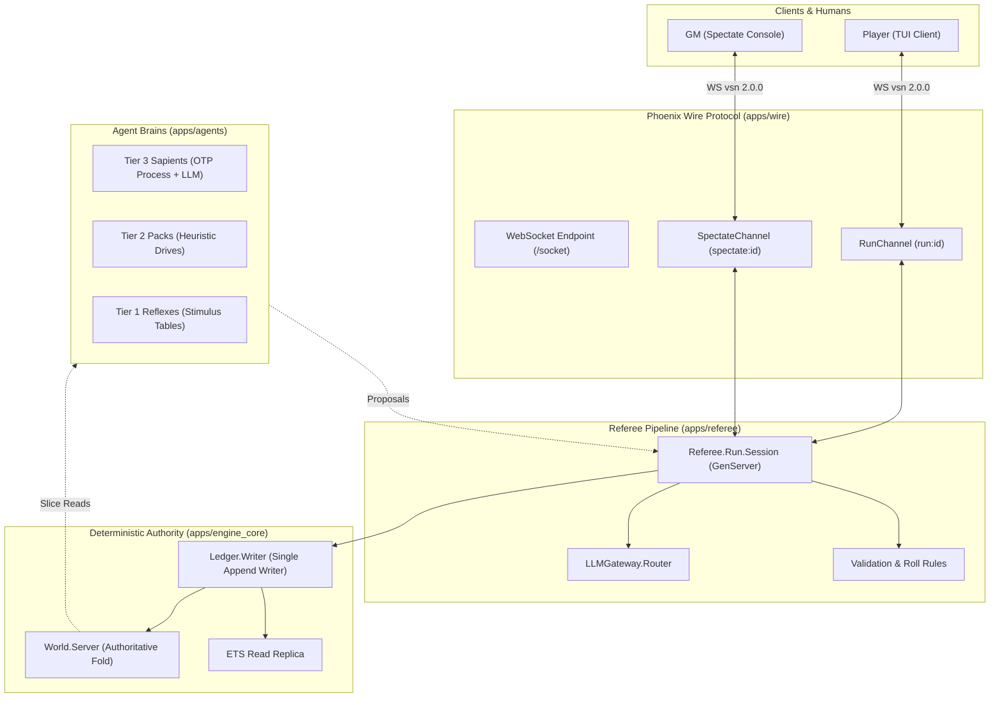

# Shards Engine — Agent-Oriented Platform (AOP) & World Runtime

The **Shards Engine** is an agent-oriented tabletop RPG runtime platform built on Elixir/OTP for AD&D 1st Edition campaign worlds (set in the realm of *Aeldoroth* during the Age of Reclamation).

Every major actor in an adventure—human player character (PC), goblin sentry, NPC captive, or the referee itself—is modeled as an independent agent operating on its own beliefs, capabilities, commitments, and cadences.

---

## Table of Contents

1. [Platform Purpose & Architecture](#1-platform-purpose--architecture)
   - [The Hybrid Brain / Ledger Split](#the-hybrid-brain--ledger-split)
   - [Referee Pipeline: LLM Proposes, Engine Disposes](#referee-pipeline-llm-proposes-engine-disposes)
   - [Perception, Signals & The Truth Barrier](#perception-signals--the-truth-barrier)
   - [Cognition Tiers](#cognition-tiers)
   - [Deterministic Replay & Auditability](#deterministic-replay--auditability)
2. [Building an Adventure YAML File](#2-building-an-adventure-yaml-file)
   - [Adventure Specification Schema](#adventure-specification-schema)
   - [Header & Metadata](#header--metadata)
   - [Referee Preference Stack](#referee-preference-stack)
   - [Home Base & Social Fabric](#home-base--social-fabric)
   - [Rooms, Spatial Edges & Traps](#rooms-spatial-edges--traps)
   - [Actors, Monsters & Cognition Tiers](#actors-monsters--cognition-tiers)
   - [Treasure & Coinage](#treasure--coinage)
   - [Engine Seed Data: Boundaries & Commitments](#engine-seed-data-boundaries--commitments)
3. [Running the AOP Adventure World](#3-running-the-aop-adventure-world)
   - [Prerequisites & Umbrella Layout](#prerequisites--umbrella-layout)
   - [Running Verification & Test Suites](#running-verification--test-suites)
   - [Running the Headless Smoke Test](#running-the-headless-smoke-test)
   - [Starting a Live Adventure Server](#starting-a-live-adventure-server)
   - [Connecting via the Web Console (Recommended)](#connecting-via-the-web-console-recommended)
   - [Connecting via the Reference Terminal Client (TUI)](#connecting-via-the-reference-terminal-client-tui)
   - [Connecting as GM / Spectator](#connecting-as-gm--spectator)
   - [LLM Gateway & Offline Fallback Modes](#llm-gateway--offline-fallback-modes)

---

## 1. Platform Purpose & Architecture

Traditional virtual tabletops are either static database viewers or scripted state machines with omniscient logic. The Shards Engine treats tabletop roleplaying as a **multi-agent simulation governed by strict referee adjudication**.



### The Hybrid Brain / Ledger Split
* **Agent Brains (`apps/agents`):** Supervised, ephemeral OTP actors. They execute the Beliefs–Commitments–Decisions (BCD) loop and make LLM calls. Brains hold **no authority state**; if a brain process crashes, it restarts without corrupting the world.
* **The Append-Only Ledger (`apps/engine_core`):** A single append-only event stream (`Ledger.Writer`) written to disk with length-prefixed records and mirrored to an in-memory ETS read replica. All world state is a pure, deterministic fold of this event stream (`World.Server`).

### Referee Pipeline: LLM Proposes, Engine Disposes
No LLM output (whether player utterance or NPC reasoning) is allowed to mutate game state directly:
1. **Propose:** The agent brain or human declares an intent in natural language.
2. **Interpret:** The intent is converted to a typed action proposal (`move`, `strike`, `shout`, `parley`, `wait`).
3. **Validate:** Validated against 1E AD&D rules and the actor's current beliefs.
4. **Resolve & Roll:** Deterministic resolution and dice rolling (`1d20`, `thac0`, saving throws, morale checks).
5. **Apply:** Resulting world events are appended to the ledger; state is folded.
6. **Narrate:** Perception events are generated and streamed to affected participants.

### Perception, Signals & The Truth Barrier
Agents and players never receive omniscient world truth.
* Sensory information propagates as **signals** (sight, sound, tremor, smell) across topological room edges.
* Closed doors, curtains, and walls attenuate or block signals.
* Per-PC fidelity applies: an elf with high Intelligence observes nuances that a goblin misses.
* If an entity was not perceived via a signal, it does not exist in the agent's belief store.

### Cognition Tiers
* **Tier 3 — Sapients (PCs, Bosses, Named NPCs):** Full BCD deliberation loop, dedicated OTP process, LLM-backed decision making.
* **Tier 2 — Pack Animals (Wolves, Rat Swarms):** Shared reactive drives (hunger, territory, panic) using pure heuristic evaluation.
* **Tier 1 — Vermin / Reflexes (Individual Rats, Mindless Minions):** Instant stimulus $\to$ action tables.
* **Tier 0 — Hazards & Traps (Tripwires, Shadow Skeletons):** Deterministic pattern triggers without cognition.

### Deterministic Replay & Auditability
Because randomness is driven by a seeded PRNG (`:rand.state()`) and all actions, rolls, prompts, and narrations are ledgered, **any run can be byte-identically replayed from its YAML seed and command log**.

---

## 2. Building an Adventure YAML File

Adventures are authored in structured YAML (see `the-ruined-tower/ruined_tower.yaml` as the canonical reference). The engine loads this file as the immutable initial state for each campaign run.

### Adventure Specification Schema

```yaml
name: "The Ruined Tower"
description: "A collapsed wizard's tower infested by goblins."
recommended_level: "1-2"
difficulty_level: "balanced"
starting_room: "entry_hall"
opening_narrative: "You stand in the common room of Mara's inn..."

preferences: ...         # Referee style and AD&D 1E rule defaults
home_base: ...           # Safe haven town, merchants, rumors, and services
rooms: ...               # Room topology, descriptions, structures, and exits
initial_enemies: ...     # NPCs, monsters, statblocks, and cognition tiers
coinage: ...             # AD&D 1E currency exchange rates
initial_treasure: ...    # Magical and mundane items
boundaries: ...          # Spatial activation triggers for off-screen sim
initial_commitments: ... # Pre-seeded obligations, duties, and orders
```

---

### Header & Metadata
```yaml
name: "The Ruined Tower"
description: "A collapsed wizard's tower infested by goblins who have been raiding the nearby village of Thornhollow."
recommended_level: "1"
difficulty_level: "balanced"
starting_room: "entry_hall"
opening_narrative: "You stand in the warm common room of Mara's inn in Thornhollow, listening to Mayor Grevik's worried voice..."
```

---

### Referee Preference Stack
Configures module-level adjudication defaults. The engine resolves rules in order: **Core 1E Rules $\to$ Module Preferences $\to$ Personal Referee YAML**.

```yaml
preferences:
  tone: "grim-but-heroic"      # Options: grim, grim-but-heroic, high-fantasy, pulp
  narration_style: "terse"     # Options: terse, descriptive, gothic
  lethality: "standard"        # Options: forgiving, standard, hardcore
  dice_visibility: "open"      # Options: open (PCs see rolls), hidden, gm_only
  xp:
    gold_per_xp: 1             # 1 gp = 1 XP (AD&D 1E standard)
    creative_bonus: true       # Award XP for parley, stealth, and hazard bypass
```

---

### Home Base & Social Fabric
Defines the staging town where players prepare, rest, and gather intelligence.

```yaml
home_base:
  name: "Thornhollow"
  description: "A small farming community surrounded by autumn fields."
  key_locations:
    - name: "Mara's Inn"
      type: "tavern"
      services: ["food and lodging", "local gossip", "rooms (1-3 gp/night)"]
    - name: "Jorren's General Store"
      type: "general_store"
      services: ["basic equipment", "rations and rope", "adventuring gear"]
  notable_npcs:
    - name: "Mayor Grevik"
      role: "village_leader"
      description: "Offers 100 gp reward for stopping the goblin threat."
    - name: "Sister Aldara"
      role: "cleric"
      description: "Gentle healer offering donation-based recovery."
  rumors:
    - "The tower belonged to Vaelith the Mirage-Weaver, an illusionist who died thirty years ago."
    - "Strange greenish lights have been seen in the tower ruins at night."
```

---

### Rooms, Spatial Edges & Traps
Rooms are bounded spaces connected by directional exits.

```yaml
rooms:
  entry_hall:
    id: "entry_hall"
    name: "Entry Hall"
    description: "The entrance to the tower is partially collapsed. Rubble litters the floor..."
    terrain: "rubble-strewn stone floor"
    lighting: "dim (daylight from collapsed ceiling)"
    structures: ["broken stone archway", "collapsed ceiling sections", "rubble piles"]
    atmosphere: "Musty and damp. Smell of old stone and goblin musk."
    exits:
      north: "library"
      east: "guard_room"
    traps:
      - id: "alarm_tripwire"
        type: "alarm"
        bound_exit: "east"
        difficulty_class: 12
        trigger_effect: "Loud clattering alerts all goblins in guard room."
```

---

### Actors, Monsters & Cognition Tiers
Define statblocks and personality parameters for each entity.

```yaml
initial_enemies:
  goblin_guard_1:
    id: "goblin_guard_1"
    name: "Goblin Sentry"
    tier: 3                             # 3 = Sapient (LLM BCD loop), 2 = Pack, 1 = Reflex
    cognition: "sapient"
    place_id: "guard_room"
    statblock:
      ac: 6                             # AD&D 1E descending AC (leather + shield)
      hd: "1-1"
      hp: 5
      thac0: 20
      attacks: 1
      damage:
        dice: 1
        sides: 6
        plus: 0
      movement: 60
      morale: 7                         # 2d6 morale check threshold
      intelligence: 8
    personality:
      traits: ["nervous", "lazy", "bullied"]
      fears: ["the Chieftain", "the dark stair"]
    tactics: "Shouts an alarm if intruders enter, then retreats to chiefs_room."
    inventory: ["short_sword", "light_crossbow", "12_bolts", "crude_leather_armor"]
```

---

### Treasure & Economy
Define monetary exchange rates and item placements.

```yaml
coinage:
  value_in_cp:
    pp: 500
    gp: 100
    ep: 50
    sp: 10
    cp: 1

initial_treasure:
  healing_potion:
    id: "healing_potion"
    name: "Potion of Healing"
    type: "potion"
    location: "library"
    description: "A small crystal vial containing glowing red liquid (restores 1d8 HP)."
    value_in_gp: 50
```

---

### Engine Seed Data: Boundaries & Commitments

#### Boundaries (Off-Screen Simulation Optimization)
Boundaries gate activation so dormant zones do not burn CPU cycles or LLM tokens:

```yaml
boundaries:
  - id: "guard_room_zone"
    place: "guard_room"
    bound_agent_ids: ["goblin_guard_1", "goblin_guard_2"]
    triggers:
      - "presence_crossing"    # Intruders enter or exit
      - "signal_arrived"       # Shouts or alarms reach the room
    sleep_after: 5             # Returns to sleep after 5 quiet ticks
```

#### Initial Commitments
Pre-seed obligations, patrol orders, and debts:

```yaml
initial_commitments:
  - id: "guard_watch_rotation"
    debtor: "goblin_guard_1"
    creditor: "goblin_chief"
    deed: "keep_watch"
    due: 100                   # Game tick when watch shifts
    priority: 8
    status: "pending"          # pending, due, kept, violated, renegotiated
```

---

## 3. Running the AOP Adventure World

The engine is built as an Elixir umbrella application inside `shards_engine/`.

### Prerequisites & Umbrella Layout

* **Erlang/OTP:** 27+
* **Elixir:** 1.17+

```
shards_engine/
├── apps/
│   ├── engine_core/   # AD&D 1E rules, deterministic Ledger.Writer & World.Server
│   ├── agents/        # Agent brain actors & prompt generators
│   ├── referee/       # Adjudication pipeline, preference stack & Run.Session
│   ├── wire/          # Phoenix Channels endpoint (RunChannel & SpectateChannel)
│   ├── client_web/    # Web play surface: lobby, player seats, GM console (LiveView)
│   ├── client_tui/    # Reference WebSocket terminal client (ClientTUI.CLI)
│   └── llm_gateway/   # Budgeted LLM router & adapter chokepoint
└── scripts/           # Standalone smoke and automation scripts
```

```sh
cd shards_engine
mix deps.get
mix compile
```

---

### Running Verification & Test Suites
Run the full umbrella test suite (349 automated tests covering rules, truth barriers, channel isolation, and byte-identical determinism proofs):

```sh
cd shards_engine
mix test
```

---

### Running the Headless Smoke Test

The smoke script boots the WebSocket server, starts a live session from `ruined_tower.yaml`, connects an automated client over real WebSockets, drives actions, and outputs the resulting ledger tail:

```sh
cd shards_engine/apps/client_tui
mix run ../../scripts/protocol_smoke.exs --port 4000
```

---

### Starting a Live Adventure Server

To host an interactive session, launch an interactive Elixir shell (`iex`) from `shards_engine/apps/client_tui`:

```sh
cd shards_engine/apps/client_tui
iex -S mix
```

Inside the `iex` console, start the WebSocket listener and initialize the adventure session:

```elixir
# 1. Start the HTTP/WebSocket server on port 4000
Bandit.start_link(plug: Wire.Endpoint, scheme: :http, port: 4000)

# 2. Define the party of Player Characters
pcs = [
  %{id: "pc_thistle", name: "Thistle", place_id: "entry_hall", int: 13, ac: 5, hd: 1, hp: 12, thac0: 20, damage: "1d8"},
  %{id: "pc_bramble", name: "Bramble", place_id: "entry_hall", int: 12, ac: 6, hd: 1, hp: 8, thac0: 19, damage: "1d6"}
]

# 3. Start the supervised adventure run
yaml_path = Path.expand("../../../the-ruined-tower/ruined_tower.yaml", __DIR__)
Referee.Run.Session.start_link("campaign_01", yaml_path, 42, pcs, data_dir: "runs")
```


### Connecting via the Web Console (Recommended)

The full play experience is served by `apps/client_web` — lobby, player seats, and GM console in a browser. Boot it with:

```sh
cd shards_engine
MIX_ENV=dev mix run --no-halt scripts/web_server.exs   # serves http://localhost:4000
```

* **Lobby (`/`)** — the scenario card, a four-seat roster builder (Thistle and Bramble prefilled; blank rows drop on submit), an advanced disclosure (seed, adventure YAML, full-roster override), and the active-runs table.
* **Player seat (`/runs/<run_id>/<pc_id>`)** — the truth-barrier play surface: scene summary with who else is here, one-click exit chips, a verb palette, a chronicle of perceptions, and the character rail (HP/AC/THAC0). Declarations go through the wire; the seat auto-rejoins after a drop.
* **GM console (`/runs/<run_id>/gm`)** — the flow board (who holds the floor, who owes an answer, which seats are connected), advance and advance-until-input levers, pause & dossier, boundary states, the always-visible LLM spend header, and a readable live ledger preview.

The seat surface is a wire client like any other — it holds zero authority; the GM console is a trusted referee surface calling `Referee.Run.Session` directly.

---

### Connecting via the Reference Terminal Client (TUI)

In a separate player terminal, connect as a claimed Player Character:

```sh
cd shards_engine/apps/client_tui
mix run -e "ClientTUI.CLI.main(System.argv)" -- \
  --url http://localhost:4000 \
  --run campaign_01 \
  --character pc_thistle
```

#### Interactive Player Commands:
* `I head east into the guard room` — Declares natural language intent (interpreted and adjudicated by the referee).
* `/sheet` — Displays the PC's current local truth slice (beliefs, health, exits).
* `/ooc Is the ceiling unstable?` — Sends out-of-character table chat to the party.
* `/quit` — Disconnects and releases the character claim.

---

### Connecting as GM / Spectator

Game Masters and observers connect to the `spectate:<run_id>` channel for unfiltered observability:

```sh
cd shards_engine/apps/client_tui
mix run -e "ClientTUI.CLI.main(System.argv)" -- \
  --url http://localhost:4000 \
  --run campaign_01 \
  --spectate
```

#### GM Slash Commands:
* `/pause` — Halts the turn scheduler, runs `:summarize` LLM compression, and generates PC belief dossiers.
* `/resume` — Resumes real-time adjudication cadence.
* `/spend` — Displays token usage and dollar costs broken down by call class (`interpret`, `deliberate`, `narrate`, `summarize`).

---

### LLM Gateway & Offline Fallback Modes

All LLM traffic routes through `LLMGateway.Router` (`apps/llm_gateway`).

* **Live Model Mode:** Configure provider credentials in your environment (e.g. `ANTHROPIC_API_KEY`, `OPENAI_API_KEY`) and map routing tables in `config/runtime.exs`.
* **Offline / Deterministic Test Mode:** When no API keys are present, the engine automatically uses:
  * **Grammar Parser:** Deterministic intent extraction for standard 1E verbs.
  * **Narration Templates:** Rulebook-styled prose output based on event tags.
  * **Scripted Adapters:** Scenario actions for repeatable regression and fuzz testing.
