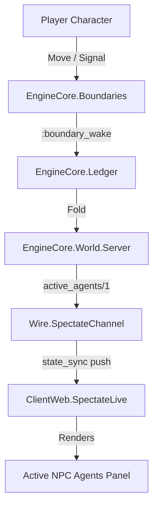

# GM Console — Active NPC Agents Section Design

## 1. Overview & Goals

In the shards_engine architecture, all non-player actors (NPCs and monsters) operate within activation boundaries (spatial place-scoped or group-scoped zones). When player characters cross into a boundary zone or emit salient acoustic signals, the engine fires a `:boundary_wake` event, transitioning the boundary to `:awake` and bound agents to `attention: :alert`.

Currently, the GM Console (`ClientWeb.SpectateLive`) displays player character intent cards in the **Party Flow Board** and static place cards in the **Dungeon Overview**, but lacks a dedicated live view of currently awakened NPC agents.

This design introduces the **Active NPC Agents** panel in the GM Console. It provides the referee with an immediate, real-time tactical and cognitive overview of every NPC and monster that is currently active due to boundary crossings.

---

## 2. Architecture & Data Flow



### 2.1 Query Function (`EngineCore.World.Server.active_agents/1`)

A dedicated query function in `EngineCore.World.Server`:

```elixir
@doc """
Returns all active non-PC agents enriched with waking boundary trigger context,
combat vitals, commitments, and roleplay dossier cues.
"""
@spec active_agents(String.t()) :: [map()]
def active_agents(run_id)
```

**Selection Algorithm:**
1. Fetch latest world snapshot: `world = snapshot(run_id)`.
2. Find all boundaries with `state == :awake`.
3. Filter `world.agents` to exclude player characters (`!Map.get(agent, :pc, false)`).
4. An agent is included if:
   - `agent.attention != :dormant`, OR
   - The agent belongs to an awake boundary (`boundary.bound_agent_ids` contains `agent.id` or matches agent's `place_id`/`group`).
5. Enrich each active agent with:
   - `id`: Unique agent string identifier.
   - `name`: Display name.
   - `tier`: Numerical tier (1 = Reflex, 2 = Scripted Pack, 3 = BDI Cognitive).
   - `group`: Associated faction/group name (e.g. `"goblin"`, `"wolf"`) or `nil`.
   - `place_id`: Current place ID.
   - `place_name`: Human-readable room/settlement name from `world.places`.
   - `boundary_id`: ID of the waking boundary.
   - `wake_tick`: Tick at which the boundary woke.
   - `wake_reason`: Reason recorded during wake event (e.g. `"presence_crossing by pc1"`, `"signal_arrived: alarm"`).
   - `hp`: Current hit points (`agent.body.hp`).
   - `hp_max`: Maximum hit points (`agent.statblock.hp_max`).
   - `ac`: Armor Class (`agent.statblock.ac`).
   - `thac0`: THAC0 attack target (`agent.statblock.thac0`).
   - `morale`: Morale rating (`agent.statblock.morale`).
   - `conditions`: List of active conditions (`agent.body.conditions`).
   - `commitments`: Active structured obligations list `[%{id, debtor, deed, due, priority, status}]`.
   - `last_intent`: Most recent deliberated action proposal or declared intent string.
   - `dossier`: Roleplay dossier map containing keys `:role`, `:personality`, `:goals`, `:knowledge`, `:rumors`.

### 2.2 Wire Serialization (`Wire.JSONSafe` & `Wire.SpectateChannel`)

* `Wire.JSONSafe`: Ensures all atoms, lists, and maps inside `active_agents` format cleanly as JSON.
* `Wire.SpectateChannel.join/3`: Snapshot payload includes `active_agents: JSONSafe.to_json(Server.active_agents(run_id))`.
* `Wire.SpectateChannel.push_state_sync/1`: Pushes `"state_sync"` with `active_agents` whenever ledger events occur.

---

## 3. User Interface & Layout Design

### 3.1 Placement in GM Console (`ClientWeb.SpectateLive`)

The **Active NPC Agents** panel is positioned in `.gm-main` (the left column), directly between the **Party Flow Board** and the **Dungeon Overview**:

```
+-----------------------------------------------------------------+
| Status Ribbon: Tick · Round · Status · Party Readiness          |
+-----------------------------------------------------------------+
| Referee Levers: [Start Round] [Auto-Run] [Pause] [LLM Spend]    |
+--------------------------------+--------------------------------+
| [.gm-main - Left Column]       | [.gm-rail - Right Column]      |
|                                |                                |
| 1. Party Flow Board            | 1. Story Chronicle             |
|    - PC cards & declared action|    - Live event feed           |
|                                |                                |
| 2. Active NPC Agents           | 2. Table Chat (OOC)            |
|    - Awakened NPCs & Monsters  |    - Persistent OOC chat       |
|    - Triggers, Vitals, BDI     |                                |
|                                | 3. Dossiers (when paused)      |
| 3. Dungeon Overview            |                                |
|    - Omniscient room cards     |                                |
+--------------------------------+--------------------------------+
| Diagnostics Drawer (LLM spend, Boundary table, Ledger tail)     |
+-----------------------------------------------------------------+
```

### 3.2 HEEx Component Markup

```heex
<section class="panel" data-testid="active-npcs-panel">
  <div class="panel-header-row">
    <h2>Active NPC Agents</h2>
    <span :if={@active_agents != [] and not is_nil(@active_agents)} class="badge badge-active" data-testid="active-npc-count">
      <%= length(@active_agents) %> active
    </span>
  </div>

  <%= if @active_agents == [] or is_nil(@active_agents) do %>
    <div class="empty-state-banner" data-testid="active-npcs-empty">
      <span class="icon">🛡️</span>
      <span>All NPC zones dormant — no active encounters or alerted actors</span>
    </div>
  <% else %>
    <div class="npc-grid" data-testid="active-npcs-grid">
      <article :for={npc <- @active_agents} class={"npc-card tier-#{npc["tier"] || npc[:tier]}"} data-npc-id={npc["id"] || npc[:id]}>
        <div class="npc-header">
          <div class="npc-title-row">
            <strong class="npc-name"><%= npc["name"] || npc[:name] %></strong>
            <span class={"badge tier-badge tier-#{npc["tier"] || npc[:tier]}"}>
              Tier <%= npc["tier"] || npc[:tier] %> (<%= tier_label(npc["tier"] || npc[:tier]) %>)
            </span>
            <span :if={npc["group"] || npc[:group]} class="badge group-badge">
              <%= npc["group"] || npc[:group] %>
            </span>
          </div>
          <div class="location-row">
            <span class="location">📍 <%= npc["place_name"] || npc[:place_name] %></span>
          </div>
        </div>

        <div class="activation-strip">
          <span class="pulse-dot"></span>
          <span class="trigger-text">
            Awake (zone: <strong><%= npc["boundary_id"] || npc[:boundary_id] %></strong> · <em><%= npc["wake_reason"] || npc[:wake_reason] %></em>)
          </span>
        </div>

        <div class="hpbar" data-testid="hpbar">
          <div style={"width: #{hp_percent(npc)}%;"} class={hp_status_class(npc)}></div>
        </div>

        <div class="npc-vitals">
          <span class="vital">HP <%= npc["hp"] || npc[:hp] %>/<%= npc["hp_max"] || npc[:hp_max] %></span>
          <span class="vital">AC <%= npc["ac"] || npc[:ac] %></span>
          <span class="vital">THAC0 <%= npc["thac0"] || npc[:thac0] %></span>
          <span class="vital">Morale <%= npc["morale"] || npc[:morale] %></span>
        </div>

        <%= if (npc["commitments"] || npc[:commitments] || []) != [] or (npc["last_intent"] || npc[:last_intent]) do %>
          <div class="npc-cognition">
            <div :if={npc["last_intent"] || npc[:last_intent]} class="intent-row">
              <span class="badge badge-intent">INTENT</span>
              <span class="intent-text"><%= npc["last_intent"] || npc[:last_intent] %></span>
            </div>
            <div :for={comm <- npc["commitments"] || npc[:commitments] || []} class="commitment-row">
              <span class="badge badge-goal">GOAL</span>
              <span class="goal-text"><%= comm["deed"] || comm[:deed] %> (due tick <%= comm["due"] || comm[:due] %>)</span>
            </div>
          </div>
        <% end %>

        <%= if has_dossier?(npc) do %>
          <% dossier = npc["dossier"] || npc[:dossier] %>
          <details class="npc-dossier-drawer">
            <summary>Roleplay Dossier</summary>
            <div class="dossier-content">
              <p :if={dossier["role"] || dossier[:role]}>
                <strong>Role:</strong> <%= dossier["role"] || dossier[:role] %>
              </p>
              <p :if={dossier["personality"] || dossier[:personality]}>
                <strong>Personality:</strong> <%= dossier["personality"] || dossier[:personality] %>
              </p>
              <div :if={(dossier["goals"] || dossier[:goals] || []) != []}>
                <strong>Goals:</strong>
                <ul class="dossier-list">
                  <li :for={goal <- dossier["goals"] || dossier[:goals]}><%= goal %></li>
                </ul>
              </div>
              <div :if={knowledge_or_rumors(dossier) != []}>
                <strong>Knowledge &amp; Rumors:</strong>
                <ul class="dossier-list">
                  <li :for={item <- knowledge_or_rumors(dossier)}><%= item %></li>
                </ul>
              </div>
            </div>
          </details>
        <% end %>
      </article>
    </div>
  <% end %>
</section>
```

### 3.3 Visual Tokens & Styling (`root.html.heex`)

* **Grid & Cards**: `.npc-grid` uses a responsive grid matching `.dungeon-grid`.
* **Pulse Indicator**: `.pulse-dot` glows amber with CSS animation to indicate active agent consciousness.
* **Tier Badges**:
  * Tier 1 (Reflex): muted silver (`#6b7280`).
  * Tier 2 (Scripted Pack): tactical cyan (`#0284c7`).
  * Tier 3 (BDI Cognitive): mythic gold (`#d97706`).
* **Empty State Banner**: Styled with muted borders and slate text so it occupies minimal vertical space when no threats are awake.

---

## 4. Dynamic Behavior & State Synchronization

1. **Mount & Join**:
   * `SpectateLive` initializes `@active_agents` to `[]`.
   * On channel connect / join reply, assigns `active_agents: reply["active_agents"] || []`.
2. **Real-time Boundary Crossings**:
   * When a player declares movement into a room containing a dormant boundary, `Boundaries.evaluate/2` generates a `:boundary_wake` event.
   * `Fold.fold/2` updates boundary to `:awake` and bound agents to `attention: :alert`.
   * `Wire.SpectateChannel` receives ledger events and pushes `"state_sync"` containing refreshed `active_agents`.
   * LiveView re-renders the panel, animating the new active NPC cards into view.
3. **Boundary Sleep**:
   * When quiet periods elapse (`sleep_after`), `Scheduler.advance/2` generates `:boundary_sleep`, returning bound agents to `attention: :dormant`.
   * Panel updates automatically, removing sleeping agents and returning to the empty state banner when zero NPCs remain active.

---

## 5. Testing & Verification Plan

1. **Engine Core Unit Tests (`apps/engine_core/test/server_test.exs` or `world_test.exs`)**:
   * Verify `Server.active_agents/1` returns empty list when all boundaries are dormant.
   * Verify waking a boundary (e.g. `guard_room_zone` or `maras_inn_zone`) causes `Server.active_agents/1` to return enriched maps with correct HP, AC, THAC0, wake trigger reason, and dossier.
   * Verify PCs are excluded from `Server.active_agents/1`.
2. **Wire Channel Integration Tests (`apps/wire/test/spectate_channel_test.exs`)**:
   * Verify initial join snapshot includes `"active_agents"`.
   * Verify `"state_sync"` broadcast contains `"active_agents"` array.
3. **LiveView Interface Tests (`apps/client_web/test/client_web/spectate_live_test.exs`)**:
   * Verify presence of `section[data-testid="active-npcs-panel"]`.
   * Verify empty state banner displays when no NPCs are awake.
   * Verify active NPC cards render with name, tier badge, wake trigger text, HP bar, vitals, and roleplay dossier drawer.
4. **Full Test Suite**:
   * Run `mix test` across all apps in the umbrella to ensure 100% green tests.
